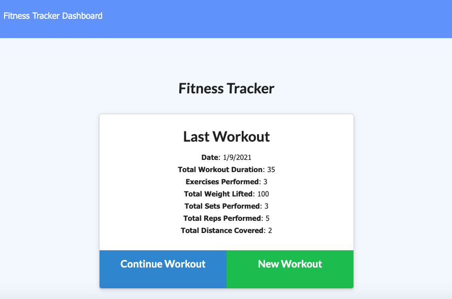

# Fitness Tracker

## Description
Track your daily workout, including multiple exercises in a workout on a given day, and more specific details such as: name, type, weight, sets, reps, duration, and distance (if cardio).

## Table of Contents
* [Installation](#installation)
* [Usage](#usage)
* [Screenshot](#screenshot)
* [License](#license)
* [Contributing](#contributing)
* [Tests](#tests)
* [Questions](#questions)
  
## Installation
Install npm packages as usual.

## Usage
Install the seeds with "npm run seed," and the server with "npm run watch" (for nodemon). Once you open the app, choose to continue the workout displayed, or create a new workout. Once you've entered new information, continue to add new workout information, start a new workout, or visit the dashboard to see workout data.

## Screeshots

## License
MIT License

    Copyright (c) 2021 Alison Lubar
    
    Permission is hereby granted, free of charge, to any person obtaining a copy
    of this software and associated documentation files (the "Software"), to deal
    in the Software without restriction, including without limitation the rights
    to use, copy, modify, merge, publish, distribute, sublicense, and/or sell
    copies of the Software, and to permit persons to whom the Software is
    furnished to do so, subject to the following conditions:
    
    The above copyright notice and this permission notice shall be included in all
    copies or substantial portions of the Software.
    
    THE SOFTWARE IS PROVIDED "AS IS", WITHOUT WARRANTY OF ANY KIND, EXPRESS OR
    IMPLIED, INCLUDING BUT NOT LIMITED TO THE WARRANTIES OF MERCHANTABILITY,
    FITNESS FOR A PARTICULAR PURPOSE AND NONINFRINGEMENT. IN NO EVENT SHALL THE
    AUTHORS OR COPYRIGHT HOLDERS BE LIABLE FOR ANY CLAIM, DAMAGES OR OTHER
    LIABILITY, WHETHER IN AN ACTION OF CONTRACT, TORT OR OTHERWISE, ARISING FROM,
    OUT OF OR IN CONNECTION WITH THE SOFTWARE OR THE USE OR OTHER DEALINGS IN THE
    SOFTWARE.

## Contributing
Help from instructor Anthony, TA Tom, & tutor Meguel.

## Tests
None, for now.

## Questions
Find me on GitHub here: https://github.com/theoriginalison
or you can reach me at aslubar@gmail.com for any additional questions.

